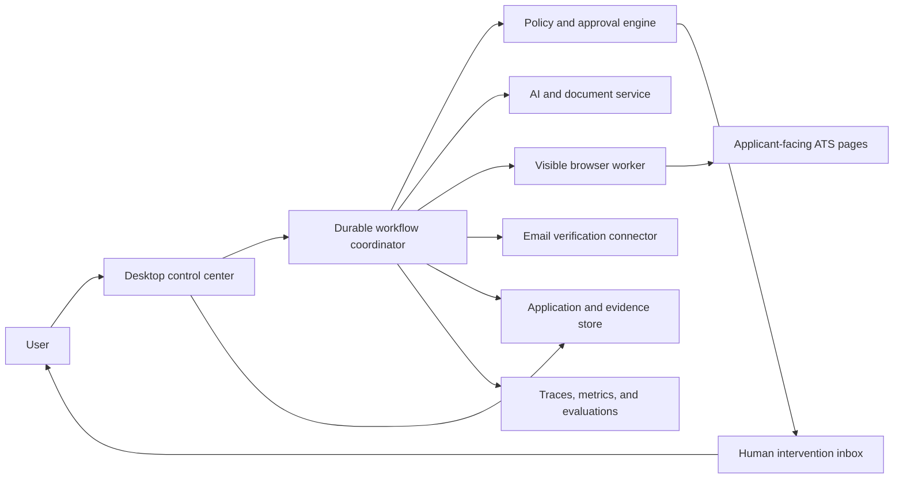

# CareerFlow Architecture

Status: accepted and in implementation; governed by `docs/adr/0001-desktop-first.md`  
Last updated: 2026-08-24

## System shape



## Proposed components

### Desktop control center

Electron with React and TypeScript. It owns onboarding, profile management, job URL intake, live browser/run status, interventions, history, statistics, settings, and application-level authorization.

### Browser worker

A TypeScript Playwright process controls a dedicated persistent Chromium profile in a visible window. It owns navigation, DOM/accessibility inspection, platform detection, adapter execution, uploads, validation capture, and confirmation evidence. It does not decide whether a sensitive action is authorized.

### Workflow and AI service

A Python FastAPI service with Pydantic schemas coordinates explicit application states. LangGraph is a proposed local workflow library for checkpoints and tool orchestration; the design must keep domain states portable to a more durable engine later. It owns parsing, evidence retrieval, grounded generation, semantic interpretation, confidence, and policy requests.

### Storage

- Operating-system keychain: passwords, OAuth refresh tokens, encryption keys.
- SQLite through SQLAlchemy and Alembic: workflow events, checkpoints, application indexes, explanations, and non-sensitive metadata.
- AES-256-GCM encrypted payloads and artifacts: candidate facts, answers, resumes, source documents, and model snapshots.
- Artifact storage: resumes, source documents, screenshots, and confirmation evidence, encrypted at rest.
- PostgreSQL and Redis are explicitly deferred. Portfolio scalability means isolated local execution across installations, not centralized browser concurrency.

### Observability and evaluation

OpenTelemetry SDKs in TypeScript and Python propagate W3C trace context across desktop actions, workflow transitions, browser tools, and model calls. Development exports OTLP to a local collector and trace viewer. Packaged builds keep bounded redacted local diagnostics and never export externally by default. User-facing statistics are rebuilt from durable workflow events rather than sampled telemetry. Logs are structured and redact secrets and unnecessary PII. Offline golden datasets and browser fixtures gate releases; production feedback creates reviewed regression cases.

### Process and API boundaries

- Electron main creates a random per-launch bearer token and supervises the Python service and browser worker.
- FastAPI binds to an ephemeral loopback port. Every HTTP, SSE, and WebSocket connection is authenticated.
- React runs in a sandboxed renderer with context isolation, no Node integration, a strict content-security policy, and allowlisted preload calls. The preload bridge is bundled as CommonJS (`.cjs`) because Electron sandboxed preloads cannot execute ESM imports.
- The Electron main bundle compiles the internal TypeScript contracts instead of loading workspace source from packaged `node_modules`. The browser worker is packaged as a runtime workspace dependency alongside its compiled contracts and Playwright dependencies; a release-layout check rejects missing or source-only entries before a DMG is accepted.
- Apple Silicon DMGs embed a relocatable CPython 3.13 runtime and locked runtime-only packages. Electron launches that interpreter directly with the packaged service source on `PYTHONPATH`; destination Macs do not run package installation or need `uv`. Development continues to use the uv-managed environment.
- The browser worker receives typed action commands only. Page content and model output cannot expand its permissions.
- Python owns canonical Pydantic contracts and OpenAPI. TypeScript definitions are generated from that schema.
- The renderer never treats its component state as application history. Electron retrieves current runs from the authenticated local API, validates the response against shared runtime schemas, and the UI refreshes its queue and Applications view from SQLite after startup and while open.
- Candidate profiles use one stable identifier and immutable versions. Each version is serialized as canonical verified facts, encrypted with AES-256-GCM using version-bound associated data, and stored as ciphertext in SQLite. The encryption key is created and retrieved only through macOS Keychain; a missing or invalid key fails closed instead of replacing it.
- Résumé files enter through an allowlisted renderer byte-array IPC and authenticated multipart loopback request. Python deterministically parses selectable-text PDF/DOCX content, stores the original as an AES-256-GCM artifact with document-bound associated data, and records only encrypted profile payloads plus non-secret indexes. Extracted statements remain unverified until explicit user review; manual profile edits preserve imported evidence history.
- OpenAI calls use the Responses API, `store=false`, strict structured outputs, and no browser, keychain, email, filesystem, or submission tools.

## Primary application flow

1. User authorizes a run and provides a job URL.
2. Job ingestion extracts the posting and detects the platform.
3. Evidence mapping prepares a job-specific resume and saved-answer plan.
4. Policy marks each planned answer as automatic, reviewable, or human-required.
5. The browser worker opens the application in a visible persistent session.
6. A deterministic adapter runs when supported; semantic fallback handles conventional unknown forms.
7. The workflow checkpoints after meaningful transitions and pauses on policy or execution blockers.
8. If submission is authorized and all gates pass, the worker submits and captures confirmation evidence.
9. The tracker records success, failure, uncertainty, interventions, timing, and artifacts.

## Interface rules

- All cross-process messages use versioned typed schemas.
- Every tool action carries a run ID, step ID, idempotency key, authorization scope, and redaction policy.
- Model output is a proposal. Deterministic validation and policy decide whether it can execute.
- Provider-specific selectors and flows live only inside adapters.
- Browser pages and email content are untrusted input and cannot directly change policy or tool permissions.

## Repository layout target

```text
apps/desktop/             Electron main process and React UI
services/agent/           Python workflow, extraction, generation, policy
packages/contracts/       Versioned shared schemas and generated clients
packages/browser-worker/  Playwright runtime, adapters, semantic fallback
docs/features/            Capability contracts
docs/adr/                 Architecture decision records
tests/fixtures/           ATS pages, documents, and evaluation datasets
```

The accepted workspace is a pnpm monorepo with an independent uv Python project. Runtime pins are Node.js 24 and Python 3.13.
